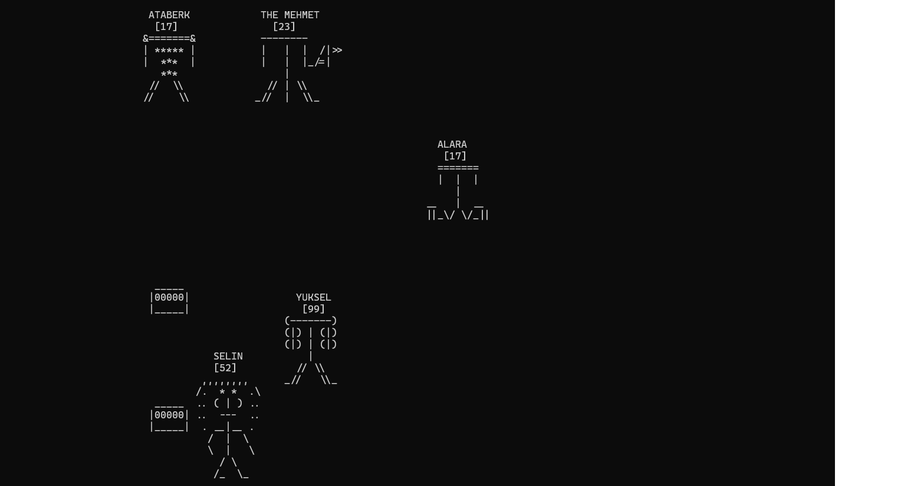

## CLI Game engine project.

I am doing this because of fun. I think it will be very useful and beautiful game engine to build command line games. 

### Current Progress:

* I am trying to finish what is very important for game object and core entity classes.
* I have a basic renderer to test my improvement. When I finish the core entity part I will split the render implementation.
* The next I still don't know. :) I don't know how to build game engines and I never used one. Any help will be appreciated.

#### Example application screenshot
